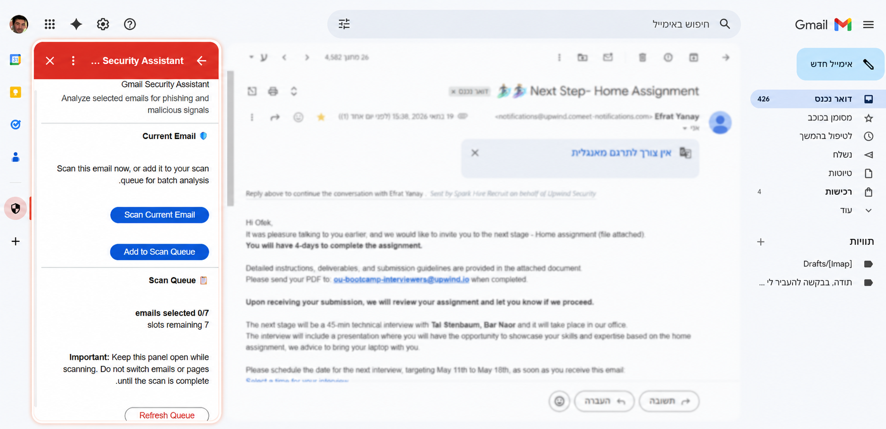

# Gmail Security Assistant

## Project Summary
Gmail Security Assistant is a Gmail-integrated security add-on that helps users analyze suspicious emails directly inside Gmail.
The system allows users to scan the currently opened email or add selected emails to a controlled Scan Queue for batch analysis. Each analyzed email receives a clear risk score, verdict, explanation, recommended actions, and optional detailed breakdown by security risk category.
The backend uses an LLM to identify and explain suspicious email indicators, while the final risk score is calculated deterministically by the backend using a weighted scoring formula.

---

## Problem It Solves
Users often need to decide whether an email is trustworthy while they are already inside Gmail. Suspicious emails may include phishing attempts, fake login pages, social engineering messages, malicious links, or unsafe attachment indicators.
Gmail Security Assistant provides an on-demand security assistant inside Gmail.

---

## System Showcase

| Add-on Home Interface | Add-on on Opened Email |
|---|---|
| The initial Gmail Security Assistant interface inside Gmail. The user can view the Scan Queue status and refresh the queue. | When a specific email is opened, the user can scan the current email or add it to the Scan Queue. |
|  |  |

---
