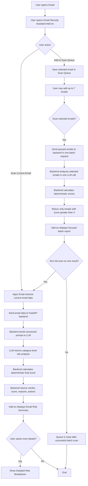

# Gmail Security Assistant

## Project Summary

Gmail Security Assistant is a Gmail-integrated security add-on that helps users analyze suspicious emails directly inside Gmail.

The system allows users to scan the currently opened email, or add selected emails to a controlled Scan Queue for batch analysis. Each analyzed email receives a clear risk score, verdict, explanation, recommended actions, and optional detailed breakdown by security risk category.

---

## Problem It Solves

Email users are frequently exposed to phishing attempts, social engineering messages, suspicious links, fake login pages, and unsafe attachments.

A common problem is that users often need to decide whether an email is trustworthy while they are already inside Gmail. Traditional security tools may work in the background, but they do not always provide a clear, user-facing explanation of why a specific email may be risky.

Gmail Security Assistant solves this by giving the user an on-demand security assistant inside Gmail. 

---

### Demo

### Screenshot 1 — Add-on Home Interface

The initial Gmail Security Assistant interface is displayed inside Gmail.  
From this screen, the user can scan the currently opened email, add it to the Scan Queue, view the number of selected emails, and refresh the queue status.


---

### Screenshot 2 — Add-on Opened on a Gmail Message

When the user opens a specific email, the add-on provides two main actions:  
scan the current email immediately, or add it to the Scan Queue for batch analysis.


---

### Demo Video — Deep Single Email Scan

This short video demonstrates a full scan of a specific opened email inside Gmail.

The flow includes:
- Opening the Gmail Security Assistant add-on
- Running **Scan Current Email**
- Viewing the risk score and verdict
- Reviewing the main reasons and recommended actions
- Opening the detailed risk breakdown by category

[Watch the deep single email scan demo](screenshots/Security_Assistant_Mail_Scanning.mp4)

---

### Demo Video — Batch Scan with Scan Queue

This short video demonstrates the Scan Queue flow for analyzing multiple selected emails.

The flow includes:
- Adding several emails to the Scan Queue
- Viewing the selected email counter
- Running **Scan Selected Emails**
- Receiving a focused report that shows only emails requiring user attention
- Automatically resetting the queue after the batch scan is completed

[Watch the batch scan demo](screenshots/Security_Assistant_Batch_Scanning.mp4)

---

### Demo Video — Malicious Email Detection

This short video demonstrates the system analyzing a deliberately suspicious demo email.

The flow includes:
- Opening a sample email with phishing-like indicators
- Running **Scan Current Email**
- Receiving a high-risk verdict
- Reviewing the reasons that triggered the risk score
- Opening the detailed breakdown to see category-level risk analysis

[Watch the malicious email detection demo](screenshots/Security_Assistant_Malicious_Mail.mp4)

---

## Architecture

The system is built from two main parts:

1. A Gmail Add-on implemented with Google Apps Script.
2. A FastAPI backend deployed on Render using Docker.

The Gmail Add-on is responsible for the user interface inside Gmail and for extracting the selected email data.  
The backend is responsible for analyzing the email, calling the LLM, calculating the final deterministic risk score, and returning a structured response to the add-on.

```text
---

## System Flowchart


---

## Key Features

- **Single Email Analysis:** Scan the currently opened Gmail message and receive a clear security assessment with risk score, verdict, summary, main reasons, and recommended actions.

- **Detailed Risk Breakdown:** View category-level explanations for Sender Risk, Content Risk, Social Engineering Risk, Link Risk, and Attachment Risk.

- **Deterministic Risk Scoring:** The LLM identifies risk signals, while the backend calculates the final score using a fixed weighted formula based on common phishing indicators.

- **Scan Queue:** Add selected emails to a controlled queue and scan multiple emails together instead of scanning the entire inbox automatically.

- **Batch Email Analysis:** Analyze up to 7 selected emails in a single backend request, reducing latency and avoiding repeated LLM calls.

- **Focused Batch Report:** The batch scan returns only emails with a final score greater than 3/10, so the user sees only emails that require attention.

- **Full Scan from Batch Results:** After a batch scan, the user can run a deeper full analysis on a specific risky email from the queue results.

- **Dockerized Backend Deployment:** The FastAPI backend is containerized with Docker and deployed on Render using a Docker-based deployment flow.

- **Backend Tests:** The project includes pytest tests for deterministic scoring, verdict mapping, batch threshold logic, missing risk categories, negative scores, and score clamping.

---

## Technical Stack

### Gmail Add-on

- **Google Apps Script** — used to build the Gmail add-on and connect it to Gmail.
- **Gmail Add-on CardService** — used to create the add-on UI cards, buttons, sections, and result screens.
- **Gmail Current Message Context** — used to access the currently opened email selected by the user.
- **PropertiesService** — used to store the Scan Queue state between Gmail screens.
- **CacheService** — used to temporarily store full scan results for the detailed breakdown screen.

### Backend

- **Python** — main backend language.
- **FastAPI** — used to expose the backend API endpoints.
- **Pydantic** — used for request and response validation.
- **OpenAI API** — used for LLM-based email risk analysis.
- **Uvicorn** — ASGI server used to run the FastAPI application.

### Deployment

- **Docker** — used to containerize the FastAPI backend.
- **Render** — used to deploy the Dockerized backend as a web service.
- **GitHub** — used for source code hosting and Render auto-deployment.

### Testing

- **Pytest** — used to test the deterministic backend scoring logic and edge cases.

