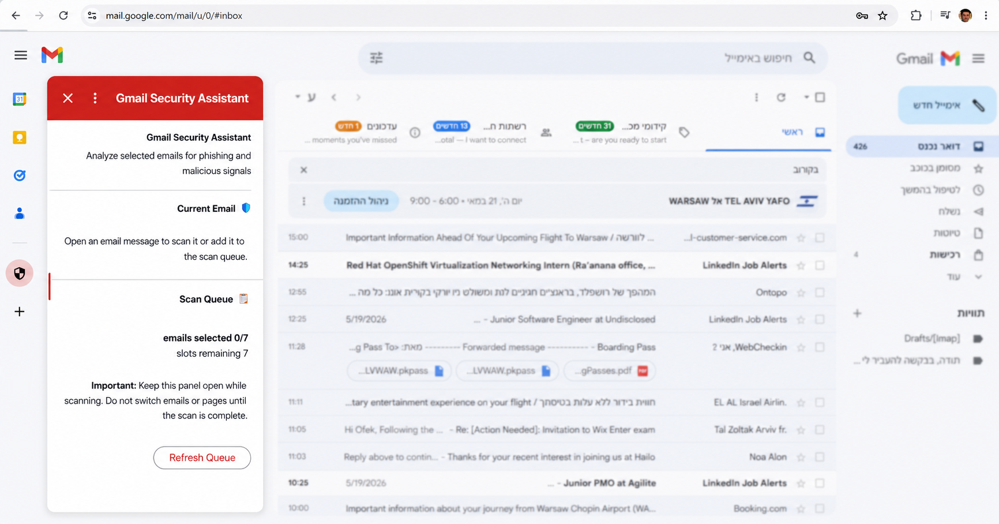
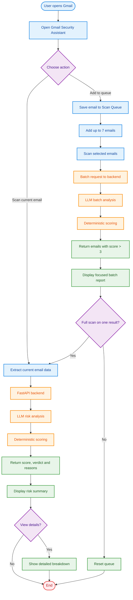

# Gmail Security Assistant

## Project Summary
Gmail Security Assistant is a Gmail-integrated security add-on that helps users analyze suspicious emails directly inside Gmail.
The system allows users to scan the currently opened email or add selected emails to a controlled Scan Queue for batch analysis. Each analyzed email receives a clear risk score, verdict, explanation, recommended actions, and optional detailed breakdown by security risk category.
The backend uses an LLM to identify and explain suspicious email indicators, while the final risk score is calculated deterministically by the backend using a weighted scoring formula.

---

## Problem It Solves
Users often need to decide whether an email is trustworthy while they are already inside Gmail. Suspicious emails may include phishing attempts, fake login pages, social engineering messages, malicious links, or unsafe attachment indicators.
Gmail Security Assistant provides an on-demand security assistant inside Gmail.

---
## System Showcase

| Add-on Home Interface | Opened Email Interface |
| :---: | :---: |
| Initial Gmail Security Assistant interface inside Gmail. | Add-on interface when a specific email is opened. |
|  |  |
---

## Demo Videos

| Deep Single Email Scan | Batch Scan with Scan Queue | Malicious Email Detection |
| :---: | :---: | :---: |
| Full scan of one opened email, including detailed breakdown. | Selecting multiple emails and running batch analysis. | Detecting a deliberately suspicious demo email. |
| [Watch demo](screenshots/Security_Assistant_Mail_Scanning.mp4) | [Watch demo](screenshots/Security_Assistant_Batch_Scanning.mp4) | [Watch demo](screenshots/Security_Assistant_Malicious_Mail.mp4) |

---

## Key Features

- **Single Email Analysis:** Scan the currently opened Gmail message and receive a clear security assessment with risk score, verdict, summary, main reasons, and recommended actions.

- **Detailed Risk Breakdown:** View category-level explanations for Sender Risk, Content Risk, Social Engineering Risk, Link Risk, and Attachment Risk.

- **Deterministic Risk Scoring:** The LLM identifies risk signals, while the backend calculates the final score using a fixed weighted formula based on common phishing indicators.

- **Scan Queue:** Add selected emails to a controlled queue and scan multiple emails together.

- **Batch Email Analysis:** Analyze up to 7 selected emails in a single backend request, reducing latency and avoiding repeated LLM calls.

- **Focused Batch Report:** The batch scan returns only emails with a final score greater than 3/10, so the user sees only emails that require attention.

- **Full Scan from Batch Results:** After a batch scan, the user can run a deeper full analysis on a specific risky email from the queue results.

- **Dockerized Backend Deployment:** The FastAPI backend is containerized with Docker and deployed on Render using a Docker-based deployment flow.

- **Backend Tests:** The project includes pytest tests for deterministic scoring, verdict mapping, batch threshold logic, missing risk categories, negative scores, and score clamping.

- **Backend Logging:** Structured backend logs were added to support debugging and failure diagnosis through Render logs when needed.

---

## System Flowchart

The diagram below shows the main system flow for both single-email analysis and Scan Queue batch analysis.


---

## Technical Stack

### Gmail Add-on

- **Google Apps Script** — used to build the Gmail add-on and connect it to Gmail.
- **Gmail Add-on CardService** — used to build the add-on UI, including cards, sections, buttons, summaries, and result screens.
- **Gmail Current Message Context** — used to access the email currently opened by the user.
- **PropertiesService** — used to store the Scan Queue state between Gmail screens.
- **CacheService** — used to temporarily store full scan results for the detailed breakdown screen.

### Backend

- **Python** — main backend language.
- **FastAPI** — used to expose the backend API endpoints.
- **Pydantic** — used for request and response validation.
- **OpenAI API** — used for LLM-based email risk analysis.
- **Uvicorn** — ASGI server used to run the FastAPI application.
- **Python Logging** — used to track scan start, scan completion, scoring results, batch analysis, and backend errors for debugging.

### Deployment

- **Docker** — used to containerize the FastAPI backend.
- **Render** — used to deploy the Dockerized backend as a web service.
- **GitHub** — used for source code hosting and automatic deployment integration with Render.

### Testing

- **Pytest** — used to test the deterministic backend scoring logic and edge cases.

---

## Scoring Logic

The system uses the LLM to identify and explain suspicious email indicators, but the final score is calculated by the backend.

This separation makes the result more consistent and explainable:

```text
LLM
Identifies risk signals and explains them by category

Backend
Calculates the final score using deterministic logic
```

### Risk Categories

The email is analyzed across five risk categories:

| Category | What It Measures |
|---|---|
| Sender Risk | Suspicious sender identity, spoofing, impersonation, or unusual domain |
| Content Risk | Suspicious wording, sensitive requests, or unusual message content |
| Social Engineering Risk | Urgency, pressure, fear tactics, or manipulation |
| Link Risk | Suspicious URLs, fake login pages, or unsafe domains |
| Attachment Risk | Suspicious attachment names, file types, or attachment-related indicators |

### Weighted Score Formula

The scoring weights were chosen according to common phishing patterns and the relative frequency and impact of typical phishing indicators.

Sender impersonation and malicious links are among the most common and impactful phishing signals, so they receive the highest weight. Message content and social engineering patterns are also central indicators because phishing emails often rely on urgency, pressure, or requests for sensitive information. Attachment risk is included with a lower weight because attachments can be dangerous, but many phishing emails do not include attachments at all.

| Category | Weight | Reason |
|---|---:|---|
| Sender Risk | 25% | Phishing often relies on spoofed, impersonated, or suspicious senders |
| Link Risk | 25% | Malicious links and fake login pages are common phishing mechanisms |
| Content Risk | 20% | Suspicious wording and sensitive requests are strong phishing indicators |
| Social Engineering Risk | 20% | Urgency, pressure, and fear tactics are common phishing techniques |
| Attachment Risk | 10% | Attachments may be dangerous, but not every phishing email includes one |

```text
Final Score =
0.25 * Sender Risk
+ 0.20 * Content Risk
+ 0.20 * Social Engineering Risk
+ 0.25 * Link Risk
+ 0.10 * Attachment Risk
```

### Verdict Mapping

| Final Score | Verdict |
|---:|---|
| 1–2 | Safe |
| 3–4 | Low Risk |
| 5–7 | Suspicious |
| 8–10 | Malicious |

For batch scans, only emails with a final score greater than 3/10 are shown in the report.
The system uses the LLM to identify and explain suspicious email indicators, but the final score is calculated by the backend.

---

## Setup and Run

The recommended way to run the backend is with Docker.  
Running locally with Python is optional and mainly useful for development or debugging.

### 1. Clone the Repository

```bash
git clone <your-repository-url>
cd gmail-security-assistant
```

### 2. Create Environment Variables

Create a `.env` file in the project root:

```env
OPENAI_API_KEY=your_openai_api_key_here
```

The `.env` file is required for the backend to call the OpenAI API and should not be committed to GitHub.

### 3. Run the Backend with Docker

Build the Docker image:

```bash
docker build -t gmail-security-assistant-backend .
```

Run the container:

```bash
docker run --env-file .env -p 8000:10000 gmail-security-assistant-backend
```

Verify the backend is running:

```text
http://localhost:8000/
```

Optional API documentation:

```text
http://localhost:8000/docs
```

### 4. Optional: Run Locally without Docker

```bash
python -m pip install -r requirements.txt
uvicorn backend.app.main:app --reload
```

Backend URL:

```text
http://127.0.0.1:8000/
```

### 5. Gmail Add-on Setup

The Gmail Add-on code is located in:

```text
gmail-addon/Code.gs
gmail-addon/appsscript.json
```

To run the add-on:

1. Open Google Apps Script.
2. Create a new Apps Script project.
3. Copy the contents of `gmail-addon/Code.gs`.
4. Copy the contents of `gmail-addon/appsscript.json`.
5. Save the project.
6. Install the test deployment.
7. Open Gmail and launch the Gmail Security Assistant add-on.

---

## Testing

The backend includes unit tests for the deterministic scoring logic and important edge cases.

The tests cover:

- Weighted final score calculation
- Verdict mapping
- Safe, Suspicious, and Malicious analysis flows
- Batch scan inclusion threshold
- Missing risk category handling
- Negative score handling
- Score clamping above 10

Run tests with:

```bash
python -m pytest
